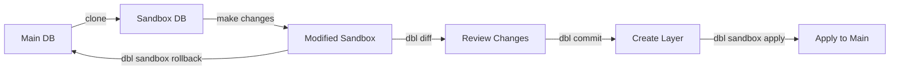

# dbl sandbox start

Create an isolated sandbox database for safe experimentation.

## Synopsis

```bash
dbl sandbox start
```

## Description

Creates a temporary copy of your main database where you can safely make and test changes. The sandbox is a complete clone that runs in isolation from your production database.

## What It Does

1. **Creates sandbox database**: Clones your main database to `{database}_sandbox`
2. **Captures baseline**: Records the current state for change detection
3. **Updates tracking**: Marks the sandbox as active in DBL state
4. **Switches context**: All subsequent DBL commands target the sandbox

## Usage Example

```bash
# Start a sandbox
dbl sandbox start

# Output:
# Creating sandbox database mydb_sandbox...
# ✓ Sandbox created successfully
# ✓ You are now working in the sandbox
# 
# Make your changes, then:
#   dbl diff           - See what changed
#   dbl commit -m "msg"  - Save changes
#   dbl sandbox apply  - Apply to main DB
#   dbl sandbox rollback - Discard changes
```

## Workflow



## Safety Benefits

### Why Use Sandboxes?

| Without Sandbox | With Sandbox |
|----------------|--------------|
| ❌ Changes affect production immediately | ✅ Changes isolated in copy |
| ❌ Mistakes can break your app | ✅ Mistakes only affect sandbox |
| ❌ Hard to undo changes | ✅ Easy rollback with `sandbox rollback` |
| ❌ No preview before commit | ✅ Full preview with `dbl diff` |

### What You Can Do in a Sandbox

- ✅ Create/drop tables
- ✅ Add/remove columns
- ✅ Modify constraints
- ✅ Test data migrations
- ✅ Experiment freely

All without risk to your main database!

## Database Naming

The sandbox database name follows this pattern:
```
{original_database}_sandbox
```

### Examples:
- `myapp` → `myapp_sandbox`
- `production_db` → `production_db_sandbox`
- `test_db` → `test_db_sandbox`

## Connection Details

While in a sandbox, DBL automatically:

- 🔄 Switches all commands to use sandbox database
- 📊 Tracks changes against the baseline
- 🚫 Prevents modifications to main database

To check which database you're using:
```bash
dbl sandbox status
```

## Docker Support

If using Docker (with `container_name` in `dbl.yaml`):

```bash
# DBL automatically runs inside the container
dbl sandbox start

# Equivalent to:
docker exec my_container createdb mydb_sandbox
docker exec my_container pg_dump mydb | docker exec -i my_container psql mydb_sandbox
```

## Complete Example

```bash
# 1. Create sandbox
$ dbl sandbox start
✓ Sandbox created: myapp_sandbox

# 2. Make changes in your database tool
# (e.g., add a column, create a table)

# 3. Review changes
$ dbl diff
+ CREATE TABLE user_preferences (...);
+ ALTER TABLE users ADD COLUMN last_login timestamp;

# 4. Commit if satisfied
$ dbl commit -m "Add user preferences table"
✓ Layer committed: L001_add_user_preferences

# 5. Apply to main database
$ dbl sandbox apply
✓ Changes applied to main database
✓ Sandbox cleaned up
```

## After Sandbox Start

Once your sandbox is active, you typically:

1. **Make changes** using your preferred database tool:
   - pgAdmin, DBeaver, MySQL Workbench, etc.
   - Or direct SQL via `psql`/`mysql` CLI

2. **Review changes**:
   ```bash
   dbl diff
   ```

3. **Commit changes**:
   ```bash
   dbl commit -m "Description of changes"
   ```

4. **Apply or discard**:
   ```bash
   dbl sandbox apply     # Keep changes
   # OR
   dbl sandbox rollback  # Discard changes
   ```

## Important Notes

!!! warning "One Sandbox at a Time"
    You can only have one active sandbox per project. Running `sandbox start` again will fail if a sandbox already exists.
    
    Check status first:
    ```bash
    dbl sandbox status
    ```

!!! tip "Always Use Sandboxes"
    DBL enforces sandbox usage by default. You cannot commit changes without an active sandbox (unless you disable `require_sandbox` in policies).

!!! info "Sandbox Persistence"
    The sandbox database persists until you run `sandbox apply` or `sandbox rollback`. Even if you close your terminal, the sandbox remains active.

## Common Issues

### Database Already Exists

```
Error: Database mydb_sandbox already exists
```

**Solutions:**
1. **Check if sandbox is active:**
   ```bash
   dbl sandbox status
   ```
2. **Rollback existing sandbox:**
   ```bash
   dbl sandbox rollback
   ```
3. **Or manually drop:**
   ```bash
   dropdb mydb_sandbox  # PostgreSQL
   ```

### Permission Errors

```
Error: Permission denied to create database
```

**Solution**: Ensure your database user has CREATE DATABASE privileges:
```sql
-- PostgreSQL
ALTER USER myuser CREATEDB;

-- MySQL
GRANT CREATE ON *.* TO 'myuser'@'localhost';
```

### Insufficient Disk Space

If your database is large, ensure you have enough disk space for a complete copy.

**Check space:**
```bash
df -h  # Unix/Linux
```

## Performance Considerations

For large databases:

- **Time**: Initial clone can take several minutes for GB-sized databases
- **Space**: Sandbox requires 2x the space of your database
- **Memory**: No extra memory needed (sandbox is separate database)

**Optimization tip**: Use `ignore_tables` in `dbl.yaml` to exclude large tables that don't need tracking:

```yaml
ignore_tables:
  - audit_logs
  - raw_data_imports
```

## Next Steps

- [Review changes with dbl diff](../changes/diff.md)
- [Commit changes](../changes/commit.md)
- [Apply sandbox](apply.md)
- [Rollback sandbox](rollback.md)

## See Also

- [`dbl sandbox apply`](apply.md) - Apply sandbox changes
- [`dbl sandbox rollback`](rollback.md) - Discard sandbox changes
- [`dbl sandbox status`](status.md) - Check sandbox state
- [`dbl diff`](../changes/diff.md) - Preview changes
