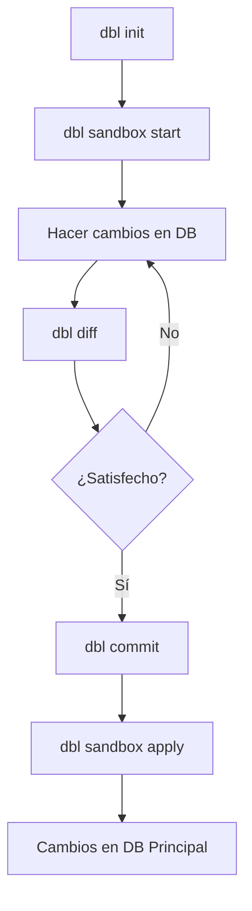

# DBL - Database Layering

<div align="center">


**Control de versiones tipo Git para bases de datos**

[Comenzar](getting-started/installation.md) · [Comandos](commands/index.md) · [Guía de Usuario](guide/configuration.md)

</div>

---

## ¿Qué es DBL?

DBL (Database Layering) es una **herramienta CLI ligera** que trae flujos de trabajo tipo Git a la evolución de esquemas de bases de datos:

- 🌿 **Ramifica tu esquema** - Trabaja en múltiples funcionalidades en paralelo
- 🔒 **Sandbox de experimentos** - Prueba cambios sin romper tu base de datos
- 📦 **Capas de cambios** - Control de versiones para migraciones SQL
- ✅ **Valida patrones** - Verificaciones automáticas para migraciones seguras
- 🔄 **Reproduce cambios** - Reconstrucciones determinísticas de base de datos

---

## Inicio Rápido

```bash
# Inicializar proyecto
dbl init

# Crear sandbox
dbl sandbox start

# Hacer tus cambios en tu base de datos...

# Confirmar cambios
dbl commit -m "Agregar tabla user_preferences"

# Aplicar cambios
dbl sandbox apply
```

---

## Características Principales

### 🏖️ Modo Sandbox

Prueba cambios en un entorno aislado sin riesgo:

```bash
dbl sandbox start      # Crea copia segura
# Haz cambios...
dbl sandbox apply      # ✓ Aplicar cambios
# O
dbl sandbox rollback   # ✗ Descartar todo
```

### 🌳 Ramificación

Trabaja en múltiples esquemas simultáneamente:

```bash
dbl branch feature-payments    # Crear rama
dbl checkout feature-payments  # Cambiar rama
dbl merge master              # Fusionar cambios
```

### 📦 Capas Versionadas

Cada cambio se guarda como una capa reproducible:

```bash
dbl commit -m "Agregar tabla payments"
dbl log                        # Ver historial
dbl reset                      # Reconstruir desde capas
```

### ✅ Validación de Migraciones

Detección automática de patrones peligrosos:

```bash
dbl validate
# ⚠️  Advertencia: DROP COLUMN detectado en contract
# ⚠️  Advertencia: Cambio de tipo en expand
```

---

## ¿Por Qué Usar DBL?

### Problema: Evolución de Esquemas es Difícil

❌ **Sin DBL:**
- Cambios manuales propensos a errores
- Sin historial de cambios de esquema
- Difícil de revertir migraciones
- Riesgoso probar cambios
- No hay forma de ramificar esquemas

✅ **Con DBL:**
- Control de versiones tipo Git
- Historial completo de cambios
- Sandboxes seguros para pruebas
- Reversión fácil con `reset`
- Ramas para desarrollo paralelo

### ¿Cuándo Usar DBL?

✅ **Ideal para:**
- Desarrollo local y staging
- Equipos pequeños/medianos
- Experimentación de esquemas
- Aprendizaje de patrones de migración
- Prototipado rápido

⚠️ **NO para:**
- Producción (aún en alfa)
- Equipos muy grandes (>20 devs)
- Bases de datos críticas sin respaldo
- Reemplazo de herramientas de migración maduras

---

## Motores Soportados

| Motor | Estado | Notas |
|-------|--------|-------|
| PostgreSQL | ✅ Completo | Recomendado |
| MySQL | ✅ Completo | Probado con 8.0+ |
| SQLite | 🚧 Planeado | Próxima versión |

---

## Flujo de Trabajo Típico



---

## Instalación Rápida

```bash
# Via pip (recomendado)
pip install git+https://github.com/alann-estrada-KSH/dbl-sandbox.git

# Verificar instalación
dbl version
dbl help
```

👉 [Guía de instalación completa](getting-started/installation.md)

---

## Ejemplo: Tu Primera Migración

```bash
# 1. Inicializar
$ dbl init
✓ Proyecto DBL inicializado

# 2. Configurar dbl.yaml
$ nano dbl.yaml  # Agregar credenciales

# 3. Crear sandbox
$ dbl sandbox start
✓ Sandbox creado: myapp_sandbox

# 4. Hacer cambios (usando tu herramienta favorita)
# Ejemplo: Agregar columna
ALTER TABLE users ADD COLUMN last_login TIMESTAMP;

# 5. Revisar cambios
$ dbl diff
+ ALTER TABLE users ADD COLUMN last_login TIMESTAMP;

# 6. Confirmar cambios
$ dbl commit -m "Add last_login tracking"
✓ Capa L001 creada

# 7. Aplicar a DB principal
$ dbl sandbox apply
✓ Cambios aplicados a myapp
```

---

## Comparación con Otras Herramientas

| Característica | DBL | Flyway | Liquibase | Rails Migrations |
|---------------|-----|--------|-----------|------------------|
| Control de versiones | ✅ | ✅ | ✅ | ✅ |
| Modo sandbox | ✅ | ❌ | ❌ | ❌ |
| Ramificación | ✅ | ❌ | ❌ | ❌ |
| Detección automática | ✅ | ❌ | ❌ | ❌ |
| Validación de patrones | ✅ | Limitado | Limitado | ❌ |
| Listo para producción | ⚠️ Alfa | ✅ | ✅ | ✅ |

---

## Conceptos Clave

### Capas (Layers)
Cambios de esquema versionados. Cada capa = una migración SQL.

### Sandbox
Base de datos temporal para pruebas seguras.

### Ramas (Branches)
Líneas paralelas de desarrollo de esquema (como ramas de Git).

### Manifest
Registro de todas las ramas, capas y su historia.

---

## Recursos

- 📖 [Documentación Completa](commands/index.md)
- 🚀 [Tutorial de Inicio Rápido](getting-started/quick-start.md)
- 💡 [Mejores Prácticas](guide/best-practices.md)
- ❓ [Preguntas Frecuentes](../reference/faq.md)
- 📝 [Changelog](../changelog.md)

---

## Advertencias Importantes

!!! warning "Software Alfa"
    DBL está en desarrollo alfa. **No lo uses en producción** sin respaldos completos.

!!! danger "Pérdida de Datos"
    DBL puede ELIMINAR bases de datos y tablas. Siempre usa sandboxes y mantén respaldos.

!!! info "Revisión Requerida"
    DBL genera SQL, pero TÚ debes revisarlo antes de confirmar. Puede producir operaciones destructivas.

---

## Comunidad y Soporte

- 🐛 [Reportar Bugs](https://github.com/alann-estrada-KSH/dbl-sandbox/issues)
- 💬 [Discusiones](https://github.com/alann-estrada-KSH/dbl-sandbox/discussions)
- 📧 Contacto: [Abrir Issue](https://github.com/alann-estrada-KSH/dbl-sandbox/issues/new)

---

## Licencia

DBL está licenciado bajo [Apache License 2.0](https://github.com/alann-estrada-KSH/dbl-sandbox/blob/master/LICENSE).

---

## Próximos Pasos

1. 📥 [Instalar DBL](getting-started/installation.md)
2. 🏃 [Tutorial de Inicio Rápido](getting-started/quick-start.md)
3. 📚 [Explorar Comandos](commands/index.md)
4. 🎯 [Aprender Mejores Prácticas](guide/best-practices.md)
